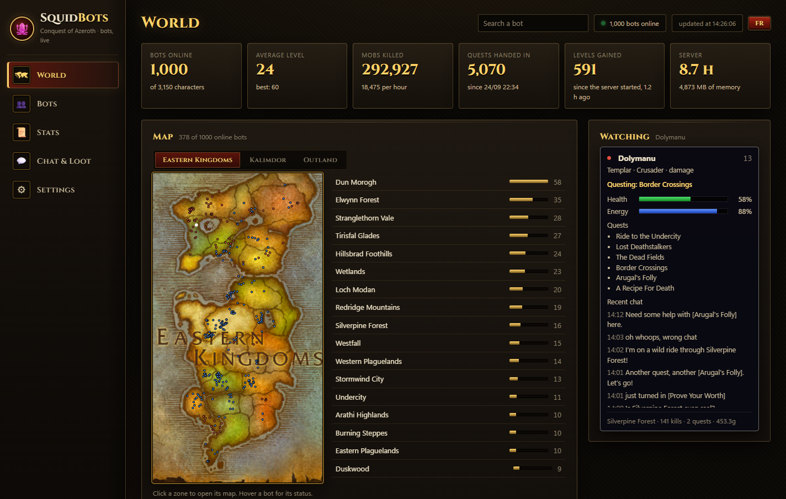
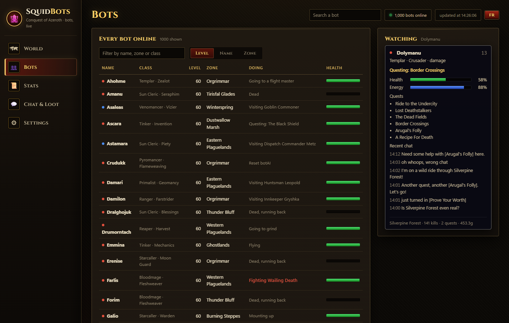
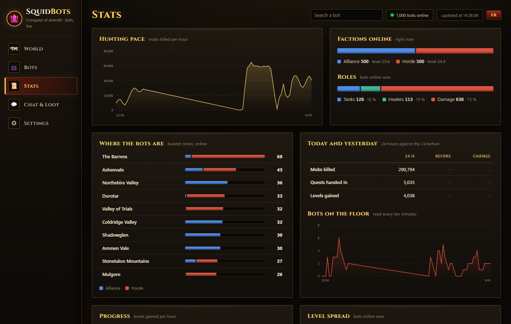
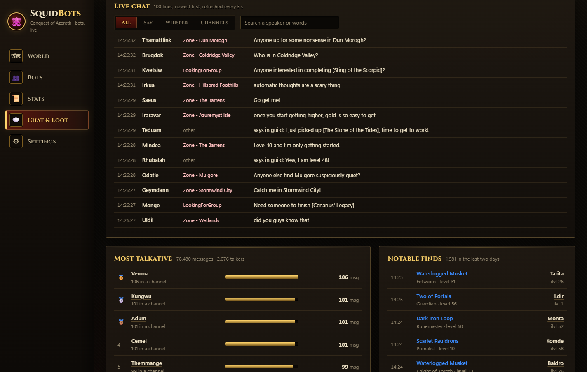
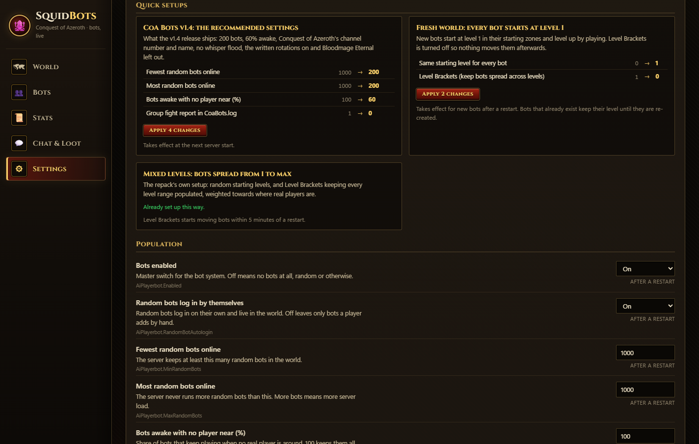
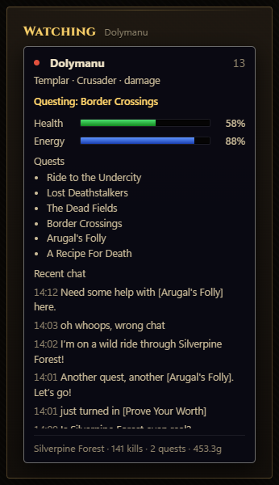

# SquidBots

**A live dashboard for an AzerothCore realm full of bots** — where they are, what they are doing,
what they kill, say and find, and whether the server held up while you slept.



Built for [Conquest of Azeroth](https://github.com/jealous-sound/azerothcore-wotlk-coa) with
[mod-playerbots](https://github.com/Zyth45/mod-playerbots/tree/coa) (branch `coa`); a plain
AzerothCore realm works too. It reads the game database and the worldserver's logs, never writes to
the database, and runs on the Python that ships with the repack: no framework, no build step, no
package to install, no request to any outside site.

It comes in two versions from the same code: a **private** one on `localhost` with everything,
including the bot settings, and a **public** copy of plain files you can put on any web server.

## What you get

**World** — the headline figures, each continent's map with every bot on it (click a zone for its
own map, a bot for its card), and the bot you follow, live: the page at the top of this file.

| **Bots** | **Stats** |
|---|---|
|  |  |
| Every bot online, sortable and filterable: class, specialization, zone, what it is doing right now, health. | Hunting pace, factions and roles, busiest zones, today against yesterday, bots on the floor, level spread, stuck bots and crashes, experience per hour, leaderboard, spells cast, class ranking. |
| **Chat & Loot** | **Settings** (private version only) |
|  |  |
| The live chat feed (private version; searchable, every 5 s), the most talkative bots, and the epics and rares they find. | The bot settings that matter, in plain words, with a warning when another setting cancels one out, and one-click recipes such as *CoA Bots v1.4: the recommended settings*. |



**Every bot has a card.** Click it on the map, in the list or through the search box: class and
specialization, what it is doing (*Fighting Blackhand Thug*, *Questing: Border Crossings*,
*Dead, running back*...), its health and power, its group, its quests and what it said lately.

The live part — task, health, power, position to the second — comes from `bot-status.json`, which
mod-playerbots writes when `AiPlayerbot.CoaStatusFile` is set (see [Live status](#live-status)).
Without it the card falls back to the last character save: alive or dead, online or not.

English and French. Dark theme. The Cinzel font is bundled under the SIL Open Font License
(`static/fonts/OFL.txt`).

<br clear="right">

## Install

Needs Python 3.9 or later and the `mysql` client binary.

1. Copy `squidbots.py`, `botconfig.py`, `index.html`, `worldmap.json`, `static/` and
   `dashboard.example.json` into a folder (`tools/` too if you want the real maps).
2. Rename the example to `dashboard.json` and fill in your paths. **Keep your database password
   out of it**: point `mysqlArgs` at a MySQL client file, or drop the folder inside a repack that
   has `Settings/database.json`. A second realm on the same MySQL names its own databases with
   `"databases": {"auth": ..., "characters": ..., "world": ...}`.
3. Run `python squidbots.py` and open http://localhost:8088 (or the `port` you set).

## Two versions: private and public

**Private** is the dashboard itself, on `http://localhost`. It has everything: Settings, the live
chat feed with every channel, memory, crashes and the watch journal. The server listens on
127.0.0.1 only, answers only requests addressed to that name (so a web page cannot rebind its own
name onto it), and accepts a write only as JSON from its own page (so another site cannot post a
form to it).

**Public** is what `publishDir` receives for a web server to serve: plain files (`index.html`,
`static/`, `worldmap.json`, `maps/`, `stats.json` once a minute, `live.json` every 12 s) and no
process anyone can reach. It is built, not filtered:

- `stats.json` carries only the keys listed in `PUBLIC_KEYS` in `squidbots.py`. A figure added
  later stays private until it is listed there.
- Never public: what real players say (no line of chat at all; "most talkative" counts bots only),
  memory, crashes, the watch journal, paths, configuration, errors.
- `live.json` carries only the bot fields the map and cards show (`PUBLIC_LIVE_FIELDS`), and no
  real player's name: a group led by a player loses its leader's name, a fight with a player reads
  "Fighting a player".
- The page's private code sits between `private:start` and `private:end` markers and is removed
  from the public files, not hidden. Publishing stops if anything private is left in them.

## Logs some cards need

Add these to `worldserver.conf` and restart; until then the cards stay empty and say so.

Spells cast, and rare finds (both need [mod-playerbots on the `coa` branch](https://github.com/Zyth45/mod-playerbots/tree/coa)):

```ini
Appender.CoaBots = 2,4,1,CoaBots.log,a
Logger.playerbots.coa = 4,CoaBots
Appender.BotLoot = 2,4,1,BotLoot.log,a
Logger.playerbots.loot = 4,BotLoot
```

Chat feed and most talkative (stock AzerothCore):

```ini
ChatLog.Enable = 1
Appender.Chat = 2,4,1,Chat.log,a
Logger.chat.say = 4,Chat
Logger.chat.yell = 4,Chat
Logger.chat.emote = 4,Chat
Logger.chat.channel = 4,Chat
Logger.chat.whisper = 4,Chat
Logger.chat.party = 4,Chat
Logger.chat.raid = 4,Chat
Logger.chat.guild = 4,Chat
```

## The Settings page

It changes values in the module `.conf` files (`playerbots.conf`, `dynamicxp.conf`, and
`mod_bot_minds.conf` when [mod-bot-minds](https://github.com/vedicveko/mod-bot-minds) is
installed). It edits values in place, never adds or reorders lines, and backs the whole file up to
`config-backups/` first. Each setting says when a change takes effect. The server reads these
files at startup, so it is easiest to use with the server stopped. Writes are accepted from the
machine itself only, from the dashboard's own page. The dashboard never writes to the game database.

## Map

`worldmap.json` (rebuilt by `tools/gen_worldmap.py`) gives the map its zones out of the box: each
zone is a rectangle in world coordinates, with the bots as dots.

For the real continent and zone maps, press **Extract maps** (above the map, or under Settings) and
give your game client folder. In about two minutes they are written to `maps/` (about 70 MB),
with nothing to install. The same from a terminal:

```bash
python tools/gen_art.py --client C:\my-client --dbc C:\my-server\server\data\dbc
```

The maps are Blizzard's and are git-ignored. With `publishDir` set, they are copied beside the public
page (about 70 MB, only new or changed files), so the public map looks like the local one; without
`publishDir` they never leave your machine. No other game art (interface, frames, icons) is used.

## Live status

Bots are placed from their last character save. For live positions, and for what each bot is doing
on its card (health, power, task, group, quests), let mod-playerbots write a `bot-status.json` every
few seconds and point `botStatusFile` in `dashboard.json` at it:

```ini
# configs/modules/playerbots.conf
AiPlayerbot.CoaStatusFile = "C:/my-server/server/logs/bot-status.json"
AiPlayerbot.CoaStatusIntervalSeconds = 5
```

It is off by default. With 1000 bots online a snapshot costs under a millisecond of the world
update, and the disk write runs on a thread of its own. A file older than 60 s is treated as stale
(the server has stopped writing it).

## The watchman

`watch-and-restart.ps1` checks the worldserver every minute and restarts it after a crash or a
freeze (a log untouched for five minutes), capturing thread stacks before killing a frozen one.

```powershell
powershell -ExecutionPolicy Bypass -File watch-and-restart.ps1 -Server C:\my-server\server
```

Its journal shows in the Stats page (`incidentsLog`). Once an hour it trims `Chat.log` in place to
the last 24 hours (`-TrimLogs`, `-TrimHours`, `-TrimEveryMinutes`). Discord alerts are opt-in: put
a webhook URL in `alerte-discord.txt` next to the script.

## Notes

- Figures follow `PlayerSaveInterval`: a kill shows when the character is saved. Rates use a
  sliding half hour for that reason.
- `baseline.json`, `history.json` and `xp-history.json` are written next to the script; delete
  `baseline.json` to restart the "gained since" figures.
- `footer` in the settings replaces the page's footer line; `""` removes it.

## Contributors

A big thank you to **[Sass42](https://github.com/Sass42)**, whose
[pull request #1](https://github.com/Zyth45/squidbots-dashboard/pull/1) turned a single page of
figures into the dashboard you see above: the side navigation and its five pages, the continent and
zone maps with the bots on them, the bot cards, the sortable roster, the live chat feed, the
Settings page with its explanations, override warnings and recipes, and the tool that extracts the
maps from your own client with nothing to install. The live bot status on the cards grew out of
their work too. Thank you!

Pull requests are welcome.

## Credits

- [jealous-sound](https://github.com/jealous-sound/azerothcore-wotlk-coa) for Conquest of Azeroth
- [mod-playerbots](https://github.com/mod-playerbots/mod-playerbots) for the bots
- [Sass42](https://github.com/Sass42) for the pages, the maps, the bot cards, the chat feed and the
  Settings page
- Written with [Claude Code](https://claude.com/claude-code); reviewed, tested and run on a real
  server with a thousand bots.
